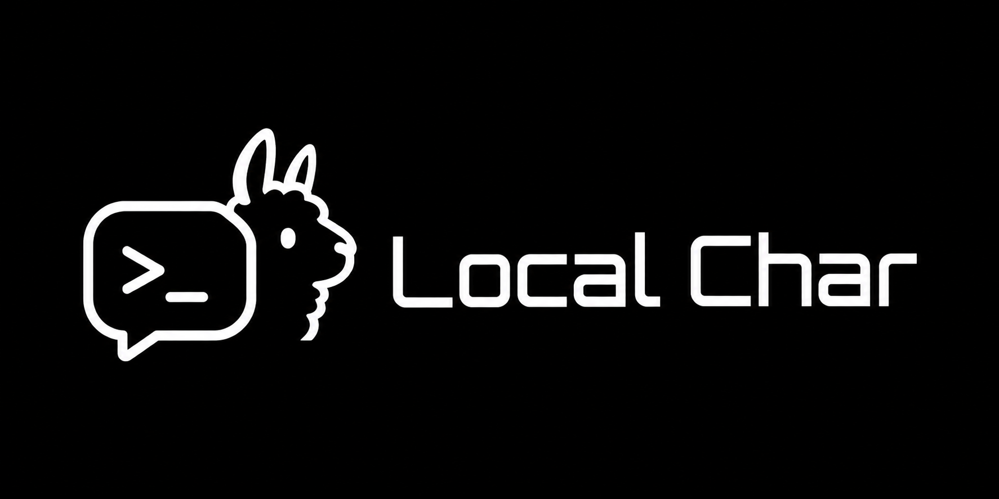
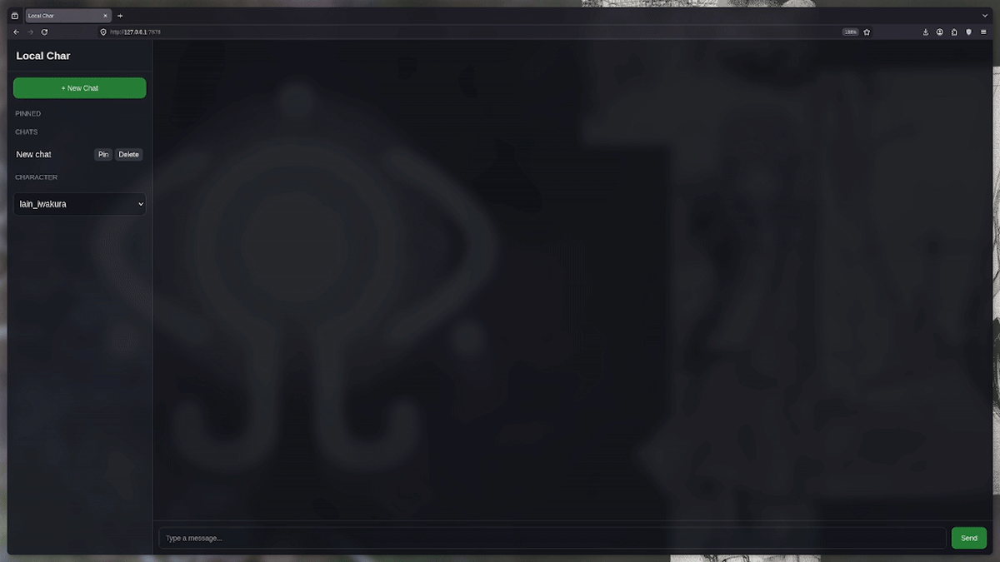
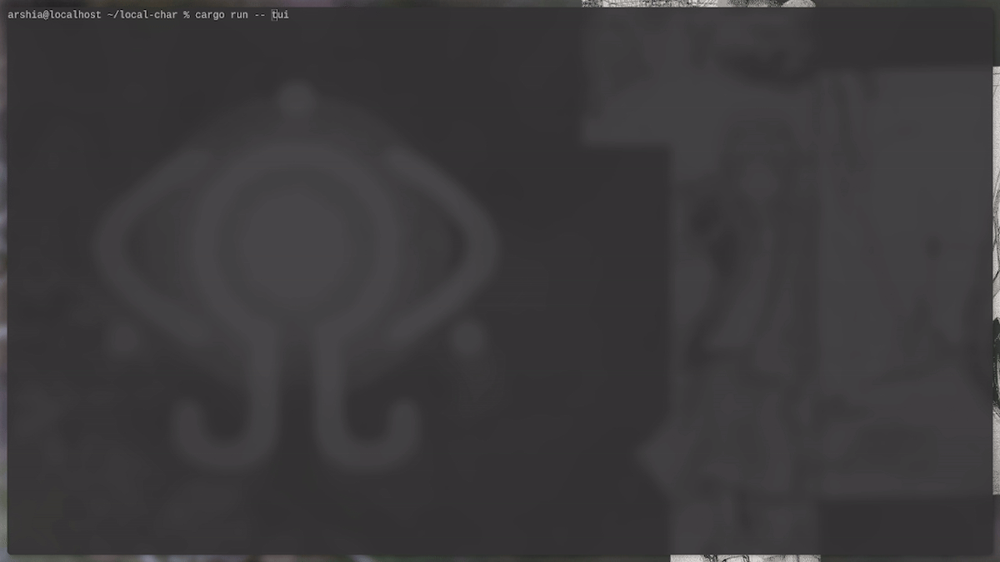

# local char
<p align="center">
  
</p>

local char is a cli and a web program that runs ai locally that can act like the character you want, the characters are mostly mad for 3-5 b models not very strong im going to add different category for the range strength of each model so it can act better like your desired character, and you dont need any cloud service, no accounts and no subscriptions.

## features
- locally run ai with llama.cpp
- has a cli
- currently have 24 characters
- chat history
- made for weaker models (for now)
- chat history
- great tui (terminal ui)
- really basic web server (with character selecting)
- lan sharing
- pinning and deleting chats 
- Lightweight and fast
- works well on smaller models

## showcase

### webserver
<p align="center">
  
</p>

### TUI
<p align="center">
  
</p>

## requirements
- Rust
-llama.cpp
- a GGUF model

## setup

This project expects **llama.cpp running**.

You need to start `llama.cpp` in server mode so it exposes an API endpoint:

how to start:

```bash
git clone https://github.com/ggml-org/llama.cpp.git
cd llama.cpp
./build/bin/llama-server -m PATH-TO-YOUR-MODEL.gguf
```

## install

make sure llama.cpp server is running

```bash
git clone https://github.com/KishaWeb/local-char.git
cd local-char
cargo install --path .
local-char
```

## usage
```bash
local-char tui (runs tui)
local-char web [--lan] (starts the web server, if you use --lan it enables lan sharing)
```

if your running it in cargo use it like this:

```bash
cargo run -- tui (runs tui)
cargo run -- web (starts web server, if you use --lan it enables lan sharing)
```

## current roster includes characters from
- Serial Experiments Lain
- Steins;Gate
- The Boys
- Death Note
- Code Geass
- Berserk
- NieR
- Persona
- Attack on Titan
- frieren
- Neon Genesis Evangelion
- ghost in the shell
- gurren lagann

## Philosophy

local char focuses on:

- locally running models
- being simple
- character roleplay

## license
MIT
